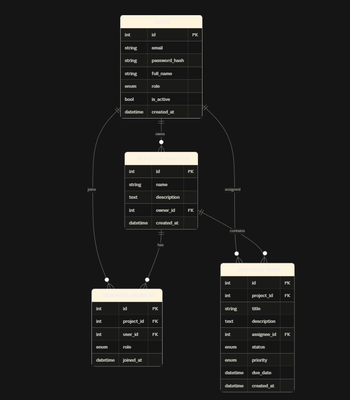

## Sơ đồ quan hệ dữ liệu (ERD)

Hệ thống gồm 4 bảng chính: `users`, `research_projects`, `research_members`, `research_tasks`.

### Bảng `users`
Lưu thông tin người dùng trong hệ thống.
- `id` (PK): khóa chính, tự tăng.
- `email`: email đăng nhập, duy nhất (unique), không được null.
- `password_hash`: mật khẩu đã được băm bằng bcrypt, không lưu plain text.
- `full_name`: họ tên đầy đủ.
- `role`: vai trò hệ thống, enum gồm `USER` và `ADMIN`.
- `is_active`: trạng thái tài khoản còn hoạt động hay không, mặc định `true`.
- `created_at`: thời điểm tạo tài khoản, tự động gán giá trị khi insert.

### Bảng `research_projects`
Lưu thông tin các đề tài/dự án nghiên cứu.
- `id` (PK): khóa chính.
- `name`: tên đề tài nghiên cứu.
- `description`: mô tả chi tiết, cho phép null.
- `owner_id` (FK -> users.id): người chủ (chủ nhiệm) đề tài, mỗi đề tài chỉ có 1 owner.
- `created_at`: thời điểm tạo đề tài.

### Bảng `research_members`
Bảng trung gian (N-N) thể hiện thành viên tham gia đề tài, mỗi dòng là 1 lần một user tham gia một project.
- `id` (PK): khóa chính.
- `project_id` (FK -> research_projects.id): đề tài mà thành viên tham gia.
- `user_id` (FK -> users.id): người dùng tham gia.
- `role`: vai trò trong đề tài, enum gồm `OWNER` và `MEMBER`.
- `joined_at`: thời điểm tham gia.
- Ràng buộc `UNIQUE(project_id, user_id)`: 1 user chỉ có thể có 1 vai trò trong 1 project, không được trùng.

### Bảng `research_tasks`
Lưu các công việc/nhiệm vụ cần làm trong từng đề tài.
- `id` (PK): khóa chính.
- `project_id` (FK -> research_projects.id): task thuộc đề tài nào.
- `title`: tiêu đề công việc.
- `description`: mô tả chi tiết, cho phép null.
- `assignee_id` (FK -> users.id, nullable): người được giao việc, có thể chưa giao (null).
- `status`: trạng thái công việc, enum `TODO`, `IN_PROGRESS`, `DONE`.
- `priority`: độ ưu tiên, enum `LOW`, `MEDIUM`, `HIGH`.
- `due_date`: hạn hoàn thành, cho phép null.
- `created_at`: thời điểm tạo task.

### Mối quan hệ
- `users` 1-N `research_projects` (qua `owner_id`): 1 user có thể sở hữu nhiều đề tài.
- `users` N-N `research_projects` thông qua bảng trung gian `research_members`: 1 user có thể tham gia nhiều đề tài, 1 đề tài có nhiều thành viên.
- `research_projects` 1-N `research_tasks` (qua `project_id`): 1 đề tài có nhiều công việc.
- `users` 1-N `research_tasks` (qua `assignee_id`): 1 user có thể được giao nhiều task, 1 task chỉ giao cho tối đa 1 người.
- Xóa 1 `research_project` sẽ cascade xóa theo các `research_members` và `research_tasks` liên quan (cascade "all, delete-orphan" trong model).
### So do ERD 
